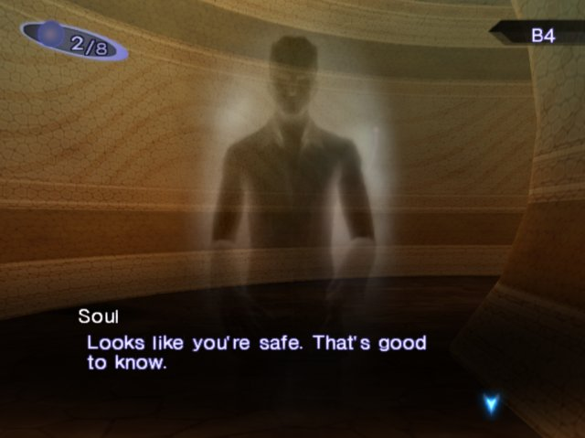

# Amala

> A decentralized video file sharing network for private groups. Think Limewire, but for video files—with invite-only groups similar to Discord servers.



> "One more God denied"

[](https://opensource.org/licenses/MIT)
[](https://nodejs.org/)
[](https://pnpm.io/)

## What is Amala?

Amala is an open-source, self-hosted video sharing platform that enables private groups to share video files with each other. Whether you're sharing family videos, anime collections, or movies from various sources, Amala gives you control over your content without ads, tracking, or corporate oversight.

The name "Amala" comes from the **Amala Network** in _Shin Megami Tensei III: Nocturne_—a vast interconnected system that channels information and enables rapid communication between terminals. Like its namesake, Amala creates an interconnected network of servers and groups, allowing secure video sharing between trusted communities.

### The Vision

We're tired of ads, broken servers, and losing access to content we love. Amala is designed to bring the discussion about digital media sharing and copyright to the forefront. We believe in open-source technology that empowers users to control their own media infrastructure.

## Key Features

- **Private Groups**: Share videos only within invite-only groups (similar to Discord servers)
- **Self-Hosted**: Run on your own infrastructure for complete control
- **Decentralized**: No single point of failure or corporate control
- **No Ads**: Your content, your rules, zero advertising
- **Secure**: Videos stay within your infrastructure and trusted groups
- **Open Source**: MIT licensed—transparent, auditable, and community-driven

## Use Cases

Amala is for any group of people who want to share video files privately:

- **Content Creators**: Share videos with collaborators or patrons
- **Families**: Store and share family videos privately
- **Communities**: Create private collections for anime, movies, or other media
- **Friends**: Set up your own video library without ads or subscriptions

## Deployment Options

### For Technical Users

Set up and run your own Amala server on infrastructure you control. Full documentation for self-hosting will be available as the project matures.

### For Everyone Else

Coming soon: The Amala Foundation will offer server setup services at cost. Donate to the foundation, and we'll help you get your own Amala server running. This ensures the project remains sustainable while keeping access affordable.

## Tech Stack

- **Frontend**: React 19, Vite, TypeScript
- **Build System**: Turborepo (Monorepo)
- **Package Manager**: pnpm
- **Code Quality**: ESLint, Prettier, Commitlint
- **Git Hooks**: Husky, lint-staged
- **Infrastructure**: AWS (for managed hosting option)

## Getting Started

### Prerequisites

- Node.js >= 20.0.0
- pnpm >= 8.0.0

### Installation

```bash
# Install dependencies
pnpm install

# Start development server
pnpm dev

# Build for production
pnpm build
```

## Project Structure

```
amala/
├── apps/
│   ├── frontend/     # React frontend application
│   ├── backend/      # Backend API server
│   └── aws/          # AWS infrastructure/deployment
├── packages/         # Shared packages and utilities
└── ...
```

## Development

### Running the Application

```bash
# Start all apps in development mode
pnpm dev

# Start only frontend
cd apps/frontend && pnpm dev
```

### Code Quality

```bash
# Lint code
pnpm lint

# Format code
pnpm format

# Type check
pnpm type-check

# Run all validation checks
pnpm validate
```

## Building for Production

```bash
# Build all applications
pnpm build
```

## Contributing

We welcome contributions to Amala! Please read our [Contributing Guide](CONTRIBUTING.md) for details on our code of conduct, the development process, and how to submit pull requests.

## Code of Conduct

This project adheres to a [Code of Conduct](CODE_OF_CONDUCT.md) that all contributors are expected to follow. Please read it before participating.

## License

This project is licensed under the MIT License - see the [LICENSE](LICENSE) file for details.

## Legal Notice

Amala is an open-source tool for video file sharing. Users are responsible for ensuring they have the legal right to share any content they upload. This project is designed to facilitate discussions about digital media sharing and copyright in the modern era.

---

**Inspired by the need for better media sharing.** Built for communities, by communities.
